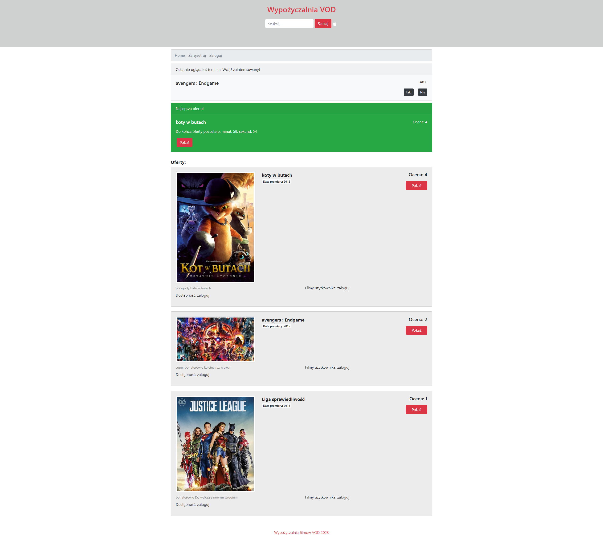

# React Search App (React and Hooks)

&nbsp;

## Table of contents

[⭐ Overview](#⭐-overview)
  - [The challenge](#the-challenge)
  - [Installation](#Installation-💿)
  - [Links](#links)

[💡 My process](#💡-my-process)
  - [Technologies](#Technologies)
  - [Solutions provided in the project](#Solutions-provided-in-the-project)
  - [Useful resources](#useful-resources)

[Screenshot](#screenshot)

[🙋‍♂️ Author](#🙋‍♂️-author)


&nbsp;

## ⭐ Overview
For me, this is one of the biggest projects created in React at the moment.
In the project, I used the knowledge acquired so far from the courses and the entire learning process. I used Bootstrap in the project to learn how to use its library and to speed up my work. The application is in development, so in the future you can expect further updates. I also used firebase as a server to store data and to host my application.
&nbsp;

### **The challenge:**

&nbsp;

### **Installation 💿**

The project uses [node](https://nodejs.org/en/), [npm](https://www.npmjs.com/), [webpack](https://webpack.js.org/) and compiler [babel](https://babeljs.io/setup#installation) as well as `ESLint` and `Prettier`.

Having them installed, type into the terminal: 

`````
git clone https://github.com/Mike161pl/wypozyczalnia-VOD.git
````
then,
````
npm i
```
Then, you may run webpack typing in the terminal:

```
npm start
```
App is available using the following addresses:
-http://localhost:3000
`````
You can log in to existing accounts that already have saved data by typing
- email address: test@o2.pl or test@gmail.com
- and password: test123 for both accounts
``````

or you can create your own account and add your favorite movie to the directory

&nbsp;

### **Links:**
- [Life URl](https://react-wyszukiwarka.web.app/)
- [GitHub](https://github.com/Mike161pl/wypozyczalnia-VOD)

&nbsp;
 
## 💡 My process

&nbsp;

### **Technologies:**


&nbsp;
  
### **Solutions provided in the project:**
- HTML:
    - The project was built using semantic HTML5 markup.
- CSS:
    - CSS style components, modules and Bootstrap classes were used in this project
- JS:
    - ES2015+ (arrow functions, destructuring, spread operator)
- React:
    - The following hooks were used: `useState`, `useContext`, `useReducer`,`useHistory`,`useRef`... and also `Custom Hook`.
    - Data is stored in `firebase` and passed to the Components using the `axios`.


Hook `useReducer` is used to control the form with user inputs. Thanks to destructuring it is possible to conveniently store data.

```
export const reducer = (state, action) => {
  switch (action.type) {
    case 'change-theme':
      const theme = state.theme === 'danger' ? 'secondary' : 'danger';
      return {...state, theme };
    case 'login':
      return {...state, user: action.user };
    case 'logout':
      return {...state, user: null };
    default:
      throw new Error('Nie ma takiej akcji: ' + action.type);
  }
}
```

&nbsp;

### **Useful resources:**

- [localStorage](http://kursjs.pl/kurs/storage/storage.php)

&nbsp;
## **Screenshot:**
&nbsp;


&nbsp;

## 🙋‍♂️ Author

The project was made by Michał Plaszczak.
- Github - Mike161pl (https://github.com/Mike161pl)
- LinkedIn - @Michał Plaszczak (https://www.linkedin.com/in/michal-plaszczak/)

 **If you have any questions do not hesitate to contact me.**


